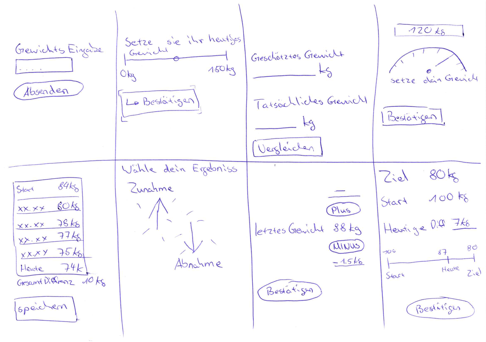
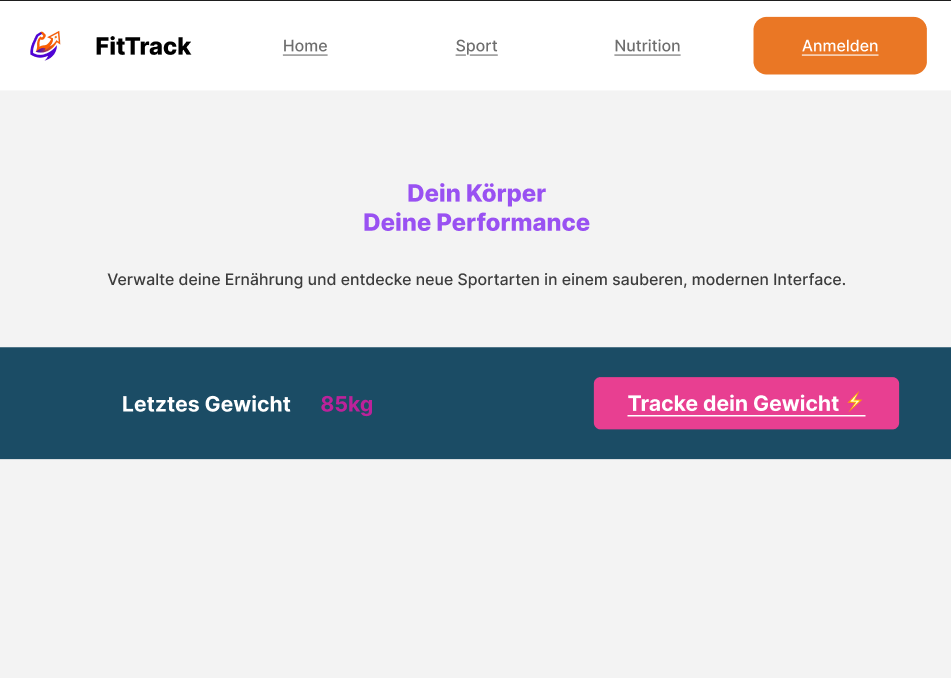

# Projektdokumentation - FitTrack

## Inhaltsverzeichnis

1. [Ausgangslage](#1-ausgangslage)
2. [Lösungsidee](#2-lösungsidee)
3. [Vorgehen & Artefakte](#3-vorgehen--artefakte)
    1. [Understand & Define](#31-understand--define)
    2. [Sketch](#32-sketch)
    3. [Decide](#33-decide)
    4. [Prototype](#34-prototype)
    5. [Validate](#35-validate)
4. [Erweiterungen [Optional]](#4-erweiterungen-optional)
5. [Projektorganisation [Optional]](#5-projektorganisation-optional)
6. [KI-Deklaration](#6-ki-deklaration)
    1. [6.1 KI-Tools](#61-ki-tools)
    2. [6.2 Prompt-Vorgehen](#62-prompt-vorgehen)
    3. [6.3 Reflexion](#63-reflexion)
7. [Anhang](#7-anhang)

---

## 1. Ausgangslage

Im modernen Fitness- und Gesundheitssektor gewinnt die datengestützte Selbstoptimierung (Quantified Self) kontinuierlich an Bedeutung. Die empirische Untersuchung des Nutzerverhaltens zeigt jedoch eine ausgeprägte Marktfragmentierung: Anwender sind heute gezwungen, parallel zwischen zwei bis drei unterschiedlichen Applikationen zu wechseln, um die interdependenten Kernbereiche Körpergewicht, Ernährung, Trainingsvolumen und Regeneration (Schlafqualität) zu protokollieren. 

Bestehende kommerzielle Lösungen (wie MyFitnessPal oder Yazio) weisen signifikante UX-Defizite auf: Sie sind durch Werbebanner überladen, mit komplexen Social-Media-Feeds gekoppelt oder drängen den Nutzer in kostenpflichtige Coaching-Abonnements. Diese funktionale Überladung führt zu einer hohen kognitiven Belastung (Cognitive Overload) und maximiert die Interaktionskosten (Interaction Costs) pro Dateneingabe. Die logische Konsequenz ist eine hohe Abbruchquote (Drop-out-Rate) der Anwender.

- **Problem:** Die manuelle Erfassung von fitnessrelevanten Metriken scheitert primär an der hohen Eingabe-Hürde (Friction) innerhalb überladener, fragmentierter Applikationen. Daten verbleiben isoliert in Silos, anstatt Zusammenhänge (z. B. der Einfluss des Trainingsvolumens oder der Schlafqualität auf den Gewichtsverlauf) visuell aggregiert darzustellen.
- **Ziele:** Das primäre Ziel des Projekts *FitTrack* ist die Konzeption und softwareseitige Implementierung einer schlanken, fokussierten und extrem benutzerfreundlichen Webanwendung. Die Applikation minimiert die Reibungspunkte bei der täglichen Datenerfassung durch ein striktes "Zero-Friction"-Eingabeprinzip. Anwender müssen in der Lage sein, Kernmetriken wie das Körpergewicht innerhalb weniger Sekunden ohne Navigationsumwege zu protokollieren und historische Trends unmittelbar visuell zu analysieren.
- **Primäre Zielgruppe:** Gesundheitsbewusste Personen, Sportler und Selbstoptimierer, die ihre Ziele tracken möchten, aber eine unkomplizierte, reine Tracking- und Analyse-Anwendung ohne werbliche Ablenkung oder Social-Features bevorzugen.
- **Weitere Stakeholder:** Das FitTrack-Team (zuständig für die manuelle Prüfung und Freigabe von Registrierungen) sowie potenziell betreuende Trainer, die auf validierte historische Daten zurückgreifen können.

---

## 2. Lösungsidee

Die Lösung umfasst eine reaktive, minimalistische Webanwendung, die als zentrales Hub für die Selbstanalyse dient. Das funktionale Fundament ruht auf den Bereichen Sport, Ernährung und Regeneration, wobei der Fokus des initialen Prototyps auf einem optimierten Gewichtstracking-System und einer sicheren Benutzerverwaltung liegt.

- **Kernfunktionalität:** 
  1. **Anmeldung & Registrierung:** Ein geschützter Login-Bereich. Neue Nutzer müssen sich registrieren und werden manuell vom FitTrack-Team bewilligt (Status: Freischaltung ausstehend), bevor sie Zugriff erhalten.
  2. **Gewicht tracken:** Eingeloggte Benutzer können über eine simple, reduzierte Maske ihr Gewicht und Datum (standardmässig das heutige Datum) eintragen.
  3. **Historie & Dashboard:** Die eingegebenen Daten werden direkt in eine historische Liste überführt, welche das Startgewicht, das aktuelle Ziel, die Tagesdifferenz und die Gesamtdifferenz berechnet und darstellt.
- **Abgrenzung:** Die Applikation fokussiert sich bewusst auf das reine Tracken und die Selbstanalyse. Komplexere Features wie Workout-Pläne, automatisierte Ernährungsberatung oder Social-Media-Sharing sind explizit nicht Teil des Umfangs, um die Schlankheit der App zu wahren.

---

## 3. Vorgehen & Artefakte

Das Projekt wurde phasenbasiert entlang der im Modul Prototyping geforderten Methodik umgesetzt.

### 3.1 Understand & Define
In der anfänglichen Analysephase wurde der Problemraum (Gesundheit, Selbstoptimierung, Prävention, Datenmanagement) detailliert ausgeleuchtet. 

- **Zielgruppenverständnis:** Über KI-gestützte Recherchen wurde erkannt, dass Nutzer von überladenen Apps frustriert sind und eine "All-in-One"-Lösung suchen. Die grösste Drop-out-Gefahr ist die aufwendige Datenerfassung.
- **Wesentliche Erkenntnisse:** 
  - Die App muss eine "Zero-Friction" Eingabe bieten (z.B. schnelle Slider oder Vorlagen).
  - Daten müssen kontextualisiert werden (Dashboard-Visualisierungen), anstatt in Silos zu verbleiben.
  - HMW-Leitfrage: *Wie kann ich all meine Daten zu Sport, Ernährung und Regeneration einfach tracken und verwalten, sodass die Erfassung schnell geht und Zusammenhänge sofort sichtbar werden?*

### 3.2 Sketch
Um den Eingabe-Workflow für das Gewichtstracking zu optimieren, wurde die Kreativmethode "Crazy 8s" angewendet. Es wurden 8 Ideen in 8 Minuten skizziert.

- **Variantenüberblick:** Die Ideen reichten von Smartphone-optimierten Slidern (0-150kg) über Gamification-Ansätze (Gewicht zuerst schätzen, dann eintragen), reine Plus/Minus-Inkrementierungen bis hin zu umfassenden KPI-Dashboards mit Timelines.
- **Skizzen:** Die Skizzen wurden durch fiktives Kommilitonen-Feedback (Luca, Sarah, Fabian) evaluiert. Die Favoriten waren der intuitive Slider (Idee 2), die Key Performance Indicator-Übersicht (Idee 8) und die Plus/Minus-Eingabe (Idee 7).



### 3.3 Decide
Nach Auswertung des Feedbacks und Abwägung der technischen Machbarkeit fiel die Entscheidung auf eine Kombination aus Idee 8 (KPI-Dashboard und Historie) und Idee 8 (Plus/Minus-Eingabe).

- **Gewählte Variante & Begründung:** Diese Kombination bietet dem Benutzer die beste Mischung aus effizienter Datenerfassung (geringe Kognitionslast) und sofortigem Mehrwert durch die direkte Berechnung der Differenzen in der Historie.
- **End-to-End-Ablauf:** Der Nutzer navigiert auf die Startseite -> wählt "Anmelden" -> gibt Credentials ein (oder registriert sich und wartet auf Freigabe) -> klickt auf "Gewicht tracken" -> gibt Datum und Gewicht ein -> drückt "Bestätigen" -> sieht den Eintrag sofort in der Historie (sofern einer vorhanden ist).
- **Mockup:** Das Figma-Design setzt auf Minimalismus. Grauer Hintergrund (`#F3F3F3`) mit knalligen Akzentfarben (Pink/Lila und Orange) für primäre Call-to-Actions.
  - Figma-Link: [FitTrack – Figma](https://www.figma.com/design/WAWi3tm6D5igHu8kYbiRws/FitTrack?node-id=1-9&t=Epu5894aXzGM7rmd-1)



### 3.4 Prototype

#### 3.4.1. Entwurf (Design)
- **Informationsarchitektur:** Sehr flache Hierarchie. Landingpage -> Login/Sign-Up -> Geschützter Bereich (Dashboard) -> Gewicht-Eingabemaske inkl. Historie. 
- **User Interface Design:** Konsequente Umsetzung des Figma-Designs. Grosse, gut lesbare Typografie. Formulardesigns sind zentriert und lenken den Fokus auf die wesentlichen Eingabefelder.
- **Designentscheidungen:** Verzicht auf störende Navigations-Elemente während des Trackings. Die Historie wird direkt unter der Eingabe angezeigt, um den Regelkreis aus Eingabe und Feedback sofort zu schliessen.

#### 3.4.2. Umsetzung (Technik)
- **Technologie-Stack:** SvelteKit (HTML, CSS, JavaScript).
- **Tooling:** Visual Studio Code als IDE, Git/GitHub für Versionskontrolle.
- **Struktur & Komponenten:**
  - **Dateibasiertes Routing-Paradigma (SvelteKit):** Die Anwendungsarchitektur nutzt konsequent das native, verzeichnisbasierte Routing-System von SvelteKit innerhalb von `src/routes/`. Dies trennt die einzelnen Anwendungsseiten logisch voneinander und vereinfacht die Skalierbarkeit des Gesamtsystems.
  - **Granulare Routenstruktur & Authentifizierungs-Flow:**
    - **Öffentliche Einstiegspunkte:** Die Kern-Landingpage (`/`) dient als ungeschützter Einstiegspunkt zur Reduktion der Absprungrate. Die statische Route `/rechtliches` kapselt datenschutz- und impressumsrechtlich relevante Inhalte und isoliert diese von der dynamischen Applikationslogik.
    - **Identitäts- und Zugriffsmanagement:** Die Routen `/login` und `/signUp` steuern die Authentifizierung. Neu registrierte Accounts durchlaufen eine serverseitige Validierungsschleife: Solange die administrative Freigabe aussteht, erzwingt das System eine Interzeption und leitet den Client auf die restriktive Informationsroute `/freischaltung-ausstehend` um.
    - **Geschütztes Administrations-Dashboard:** Unter `/admin/users` wird eine privilegierte Steuerungskonsole bereitgestellt, über die Administratoren den Freigabestatus (`approved: true/false`) von Benutzerkonten zur Laufzeit über Server-Side Actions mutieren können.
    - **Core-Tracking-Domänen:** Die Route `/weighttracking` bildet das hochfrequentierte Zentrum des Prototyps für das Gewichtstracking. Die Domänen `/nutrition` und `/sport` (inklusive der dynamischen Parameter-Route `/sport/[id]` für detaillierte Kursansichten) sind architektonisch als modulare Säulen vorbereitet, um eine nahtlose funktionale Erweiterung des Dashboards ohne Restrukturierung des Quellcodes zu ermöglichen.
  - **Kapselung und Wiederverwendbarkeit (UI-Komponenten):** Innerhalb des Verzeichnisses `src/lib/components/` sind funktionale UI-Bausteine wie `SportsCard.svelte` und `NutritionCard.svelte` als wiederverwendbare, deklarative Komponenten gekapselt. Diese Struktur minimiert redundanten HTML/CSS-Code (DRY-Prinzip) und entkoppelt die visuelle Präsentationslogik von den umschliessenden Page-Views.
  - **Zentralisierte Sicherheits- und Persistenzsteuerung:**
    - **Server-Side Route Guards:** Die Datei `src/hooks.server.js` fungiert als globaler Interzeptor auf Serverebene. Sie validiert jede eingehende HTTP-Anfrage im Request-Response-Zyklus, überprüft den aktuellen Session- und Bewilligungsstatus gegen die Datenbank und blockiert unberechtigte Zugriffe auf sensible Pfade (wie `/weighttracking` oder `/admin`) direkt vor der Page-Instanziierung.
    - **Datenbank-Abstraktionsschicht:** Die Datei `src/lib/server/db.js` kapselt die Verbindungsinitialisierung und den Client-Treiber für die persistente MongoDB-NoSQL-Datenbank. Dadurch verbleiben geheime Verbindungszeichenfolgen (Connection Strings) sicher auf der Serverseite und die eigentlichen Routen-Server-Dateien (`+page.server.js`) greifen über ein definiertes Interface sauber auf die Datenströme zu.
  - **Domain-Driven Styling (CSS-Modularisierung):** Um Kaskadiergungs-Konflikte (Style Bleeding) und unübersichtliche monolithische CSS-Dateien zu verhindern, wurde das Design in spezifische Stylesheets zerlegt. Während `style.css` als globales Fundament dient (Design-Tokens, CSS-Reset, Typografie, sowie die Definition des leicht grauen Hintergrunds `#F3F3F3`), isolieren `benutzerverwaltung.css`, `styleTracker.css` und `rechtliches.css` die UI-Regeln auf ihre jeweiligen logischen Anwendungsbereiche. 
  - **Grafische Abbildung der Ordnerstruktur:**

    ```text
    pt_sportnutrition/
    ├── src/
    │   ├── hooks.server.js             # Globaler Server-seitiger Route-Guard & Session-Validierung
    │   ├── lib/
    │   │   ├── components/             # Wiederverwendbare, modulare UI-Komponenten
    │   │   │   ├── NutritionCard.svelte 
    │   │   │   └── SportsCard.svelte    
    │   │   └── server/
    │   │       └── db.js               # Zentralisierte, persistente MongoDB-Datenbankanbindung
    │   └── routes/                     # SvelteKit Routing-Zentrum & Page-spezifische Styles
    │       ├── +layout.server.js       
    │       ├── +layout.svelte          
    │       ├── +page.svelte            # Öffentliche Landingpage
    │       ├── benutzerverwaltung.css  # Isoliertes CSS für Registrierung, Login und Administration
    │       ├── rechtliches.css         # Isoliertes CSS für rechtliche Informationsseiten
    │       ├── style.css               # Globales Basis-Stylesheet
    │       ├── styleTracker.css        # Dediziertes CSS für das reaktive Dashboard-Interface
    │       ├── admin/
    │       │   └── users/              # Administrations-Panel für Nutzerfreigaben
    │       ├── freischaltung-ausstehend/ 
    │       ├── login/                  
    │       ├── nutrition/              
    │       ├── rechtliches/            
    │       ├── signUp/                 
    │       ├── sport/                  
    │       └── weighttracking/         # Core-Tracking-Interface für Gewichtskennzahlen
    ├── static/                         # Statische Assets (Bildmaterialien, Produktgrafiken, Vektor-Icons)
    ├── netlify.toml                    # Konfigurationsdatei für das automatisierte Netlify-Cloud-Deployment
    └── package.json                    # Deklaration der Projektabhängigkeiten und NPM-Skripte

- **Daten & Schnittstellen:** Anbindung einer Datenbankstruktur (via `src/lib/server/db.js`), um Benutzereingaben persistent zu speichern und Authentifizierungs-Workflows (inklusive Admin-Freigabe) abzuwickeln.
- **Deployment:** [ptsportnutrition.netlify.app](https://ptsportnutrition.netlify.app)
- **Besondere Entscheidungen:** Serverseitige Route-Guards (`hooks.server.js`), um sicherzustellen, dass nur überprüfte User tracken können.

### 3.5 Validate
- **URL der getesteten Version:** [https://ptsportnutrition.netlify.app](https://ptsportnutrition.netlify.app)
- **Ziele der Prüfung:** Die Evaluation wurde als formative Usability-Prüfung durchgeführt, um Verbesserungspotenziale während der Prototypen-Phase zu identifizieren. Das primäre Ziel bestand in der Validierung der "Zero-Friction"-Hypothese bei der Gewichtseingabe sowie der Überprüfung der Verständlichkeit des restriktiven Administrations-Workflows.
- **Vorgehen:** Es wurde ein moderierter Usability-Test (On-Site) durchgeführt. Den Probanden wurde die Applikation auf einem Laptop präsentiert, wobei sie gebeten wurden, szenariobasierte Aufgaben zu lösen. Dabei kam die "Think-Aloud"-Methode zum Einsatz, um die kognitiven Prozesse und allfällige Verwirrungen der Nutzer unmittelbar erfassen zu können. Die Identifikation und Gruppierung der Probleme (Issues) erfolgte strukturanalog zu einer Issue Map.
- **Stichprobe:** Die Evaluation wurde mit 2 Probanden durchgeführt. Das Profil der Testpersonen entsprach der definierten Kernzielgruppe (gesundheitsbewusste Personen im Alter von 22–28 Jahren, die bereits Erfahrung mit Fitness-Apps haben).
- **Aufgaben/Szenarien:**
  Die Testpersonen mussten folgende aufeinander aufbauende Szenarien durchlaufen:
  1. *Onboarding & Registrierung:* "Du bist neu bei FitTrack und möchtest deine Daten tracken. Erstelle einen Account. Was erwartest du als nächsten Schritt?"
  2. *Login-Barriere:* "Dein Account wurde soeben manuell vom FitTrack-Team freigeschaltet. Logge dich mit deinen Daten ein."
  3. *Tracking-Workflow:* "Trage dein heutiges Startgewicht von 85 kg ein. Betrachte anschliessend das Dashboard. Was sagen dir die angezeigten Daten?"
- **Kennzahlen & Beobachtungen:**
  - **Erfolgsquote:** 100 % bei der reinen Datenerfassung (Szenario 3). 50 % (1 von 2 Probanden) waren bei Szenario 1 kurzzeitig irritiert, da der Workflow nach der Registrierung abrupt bei "Freischaltung ausstehend" endete.
  - **Zeitbedarf:** Der Zeitbedarf für das Eintragen des Gewichts (nach erfolgreichem Login) lag bei allen Probanden unter 30 Sekunden, was die "Zero-Friction"-Hypothese messbar stützt.
  - **Qualitative Findings (Issues):** - *Issue 1 (Verständnis):* Der "Freischaltung ausstehend"-Screen wurde als zu passiv empfunden. Nutzer wussten nicht, ob sie eine Bestätigungs-E-Mail erhalten oder die Seite neu laden müssen.
    - *Issue 2 (Usability):* Die reine Eingabe über das Nummernfeld ist sehr schnell, jedoch wünschten sich die Nutzer ein Filterung.
    - *Issue 3 (Kognitive Last):* Die Historien-Differenz (z. B. "-1.5 kg") wurde verstanden, erfordert aber einen kurzen mentalen Abgleich, ob dies nun ein positiver oder negativer Fortschritt ist.
- **Zusammenfassung der Resultate:** Die zentrale Kernfunktion der Applikation, das reibungslose und extrem schnelle Tracken des Körpergewichts wurde von der Stichprobe ausnahmslos positiv und als sehr intuitiv bewertet. Signifikantes Verbesserungspotenzial besteht hingegen noch im Systemfeedback während des Onboarding-Prozesses, da die ausstehende Admin-Freigabe ohne weitere textliche Begleitung zu Unsicherheiten auf Nutzerseite führt.
- **Abgeleitete Verbesserungen:**
  Basierend auf den identifizierten Issues wurden folgende Massnahmen priorisiert:
  1. **Überarbeitung der "Freischaltung ausstehend"-View (Priorität: Hoch):** Ergänzung eines klaren Hinweistextes (z. B. "Das FitTrack-Team prüft deine Anfrage. Wir benachrichtigen dich, sobald du loslegen kannst."), um die Erwartungshaltung zu managen und Abbrüche zu verhindern. *(Wurde nach der Evaluation direkt im Prototyp umgesetzt).*
  2. **Visuelle Codierung der Historie (Priorität: Mittel):** Implementierung einer bedingten Formatierung (Grün für Gewichtsverlust, Rot/Neutral für Zunahme) für die Differenz-Zahlen, um die kognitive Belastung beim Lesen des Dashboards weiter zu minimieren.
  3. **Filterung der Gewichtshistorie Einträge (Priorität: Niedrig):** Die Daten der Gewichtshistorie können durch diverse sinnvolle Filter eingeschränkt werden.  


---

## 4. Erweiterungen [Optional]

## 4. Erweiterungen [Optional]

In diesem Kapitel werden diejenigen Funktionalitäten und architektonischen Konzepte dokumentiert, welche bewusst über den definierten Mindestumfang des Moduls hinausgehen. Diese Erweiterungen dienen primär der Erhöhung der Plattformsicherheit, der technischen Skalierbarkeit sowie der qualitativen Aufwertung der Benutzererfahrung.

### 4.1 Administrativer Freischaltungs-Workflow und Rollenmanagement
- **Beschreibung & Nutzen:** Um die Integrität der Plattform zu gewährleisten und unautorisierten Zugriff auf die sensiblen Tracking-Daten zu verhindern, wurde ein rollenbasiertes Freigabesystem implementiert. Neu registrierte Benutzerkonten werden systemseitig standardmässig mit einem inaktiven Status versehen und erfordern eine manuelle Verifikation durch einen Administrator, bevor der Login-Prozess erfolgreich abgeschlossen werden kann. Diese Zugriffskontrolle erhöht die allgemeine Systemsicherheit massiv und stellt eine hohe Datenqualität sicher.
- **Wo umgesetzt:** Auf der Frontend-Seite existieren dedizierte Ansichten für den Registrierungsprozess und eine spezifische Informationsseite für Konten mit ausstehender Freischaltung. Im Backend wird dieser Mechanismus durch einen globalen Interzeptor in der Datei `hooks.server.js` gesteuert, welcher serverseitig alle Routen absichert, während die Statusmutation durch Administratoren über die serverseitige Logik in `admin/users/+page.server.js` direkt auf der MongoDB-Datenbank ausgeführt wird.
- **Referenz:** Diese architektonische Entscheidung wird ebenfalls im Kapitel 3.4.2 im Bereich der Struktur und Komponenten detailliert erläutert.
- **Aus Evaluation abgeleitet?:** Nein, es handelt sich hierbei um eine proaktive Architekturentscheidung zur Erhöhung der Informationssicherheit, welche bereits in der konzeptionellen Entwurfsphase getroffen wurde.

### 4.2 Responsives Webdesign und geräteübergreifende Optimierung
- **Beschreibung & Nutzen:** Obwohl die initialen Figma-Mockups im Rahmen der Designphase primär auf eine allgemeine Desktop-Ansicht fokussiert waren, wurde die tatsächliche Webanwendung konsequent responsiv umgesetzt. Diese Entscheidung basiert auf der strategischen Überlegung, dass  die tägliche Datenerfassung des Körpergewichts in der Regel unmittelbar im Badezimmer oder im Fitnessstudio über mobile Endgeräte erfolgt. Durch die Implementierung fliessender Layouts passt sich die Benutzeroberfläche dynamisch an unterschiedlichste Viewports und Bildschirmgrössen an, was die Interaktionskosten für den Endnutzer minimiert und ein konsistentes, plattformunabhängiges Nutzungserlebnis garantiert.
- **Wo umgesetzt:** Die technische Realisierung erfolgte in der Frontend-Schicht durch den systematischen Einsatz von CSS-Media-Queries sowie adaptiven Flexbox-Layouts. Diese responsiven Stilregeln wurden sauber und wartbar in die bestehende modulare CSS-Architektur, insbesondere in die globale `style.css` sowie die komponentspezifische `styleTracker.css`, integriert.
- **Referenz:** Der Anspruch an ein responsives Design wurde bereits im Vorfeld in den Designentscheidungen des Mockup-Dokuments explizit als Ziel definiert und ist in der live deployten Version der Applikation auf verschiedenen Endgeräten überprüfbar.
- **Aus Evaluation abgeleitet?:** Nein, die responsive Ausgestaltung war eine proaktive Architekturentscheidung aus der anfänglichen Problemraumanalyse, deren positiver Effekt auf die Eingabegeschwindigkeit bei der mobilen Nutzung jedoch in den Usability-Tests deutlich bestätigt wurde.

### 4.3 KPI-orientiertes Tracking-Dashboard
- **Beschreibung & Nutzen:** Der Funktionsumfang der simplen Gewichtseingabe wurde über eine einfache Listenansicht hinaus zu einem interaktiven Dashboard erweitert, welches zentrale Leistungskennzahlen wie Startgewicht, Zielgewicht und aktuelle Abweichungen aggregiert darstellt. Dadurch erhalten die Anwender einen direkten und kontextualisierten Einblick in ihren Fortschritt, was die kognitive Belastung bei der Dateninterpretation spürbar reduziert und die Motivation durch unmittelbares visuelles Feedback fördert.
- **Wo umgesetzt:** Die visuelle Repräsentation dieser Kennzahlen findet im Frontend innerhalb der Kernroute `weighttracking/+page.svelte` statt. Die logische Aggregation, wie etwa die dynamische Berechnung der Differenzen zwischen den einzelnen Gewichtseinträgen, wird von der serverseitigen Anwendungslogik übernommen und als bereinigter Datensatz an die Präsentationsschicht übergeben.
- **Referenz:** Das Design und die Motivation hinter diesem Dashboard werden im Rahmen der Designentscheidungen im Kapitel 3.3 Decide sowie anhand des Figma-Mockups beschrieben.
- **Aus Evaluation abgeleitet?:** Ja, die Ausrichtung auf klare Kennzahlen wurde durch das simulierte Kommilitonen-Feedback in der Sketch-Phase angeregt und als direkte Folge der Erkenntnisse aus der Validierungsphase weiter priorisiert.

---

## 5. Projektorganisation [Optional]

- **Repository & Struktur:** Das Projekt wurde sauber mit Git versioniert. Die Ordnerstruktur nutzt konsequent die SvelteKit-Vorgaben (Trennung von `src/lib/` für Komponenten/DB-Logik und `src/routes/` für Pages).
- **Styling-Struktur:** Das CSS wurde in dedizierte Dateien ausgelagert (`style.css`, `styleTracker.css`, `benutzerverwaltung.css`), um Modularität zu wahren.

---

## 6. KI-Deklaration

### 6.1 KI-Tools
- **Eingesetzte Tools:** Google Gemini Pro (sowie punktuell Perpexity zur Code-Generierung).
- **Zweck & Umfang:** Der primäre und intensivste Einsatz der KI fand in der Implementierungsphase (Prototype) als Programmier-Assistenz (Pair-Programming) statt. Die KI unterstützte massgeblich bei der Erstellung von Code, der Formulierung komplexer Server Actions (z. B. für den Login- und Registrierungs-Workflow), der Einrichtung der MongoDB-Persistenzschicht (`db.js`) sowie beim Debugging von CSS-Vererbungsfehlern. Ergänzend wurde die KI in den frühen Phasen zur Marktrecherche und zur Simulation von qualitativem Kommilitonen-Feedback (Crazy 8s) genutzt.
- **Eigene Leistung (Abgrenzung):** Die Definition der Systemarchitektur, das Design des Datenbank-Schemas, die Erstellung der Figma-Mockups und die finale Logikverknüpfung wurden vollkommen eigenständig erbracht. Jeder von der KI generierte Code-Block wurde einem manuellen Code-Review unterzogen und in die modulare Projektstruktur integriert. Die KI fungierte als Effizienz-Katalysator, während die architektonische Kontrolle stets beim Entwickler lag.

### 6.2 Prompt-Vorgehen
Beim Prompting wurden je nach Projektphase zwei unterschiedliche Strategien angewendet:
- **Technisches Prompting (Prototype):** Für die Programmierung wurden stark kontextualisierte und präzise Prompts verwendet, um Halluzinationen zu minimieren. Beispiel: *"Schreibe eine SvelteKit Server Action für die +page.server.js, die Formulardaten asynchron validiert und als neues Dokument in eine bestehende MongoDB-Collection einfügt. Verwende moderne SvelteKit-Syntax."*
- **Rollenbasiertes Prompting (Sketch):** Für die Evaluation der Skizzen wurde das *Context-Driven Roleplaying* genutzt. Der KI wurde der exakte akademische Rahmen (Wirtschaftsinformatik, 4. Semester, ZHAW) sowie die Rolle von drei fiktiven Kommilitonen (Fokus: Usability, Gamification, Data) zugewiesen, um strukturiertes und mehrdimensionales Feedback zu den Crazy 8s zu erzwingen.

### 6.3 Reflexion
Der Einsatz der KI im Bereich der Softwareentwicklung erwies sich als äusserst wertvoll, da er den Entwicklungsprozess massiv beschleunigte, insbesondere beim Aufsetzen der initialen Datenbankverbindungen und repetitiven Markup-Strukturen. 
Ein klares Risiko war jedoch die Tendenz der KI-Modelle, veraltete Code-Strukturen (insbesondere SvelteKit-Syntax von vor Version 1.0) vorzuschlagen. Dies verdeutlichte, dass KI den Entwickler nicht ersetzt: Es bedurfte eines fundierten Verständnisses der offiziellen Dokumentation, um fehlerhafte Vorschläge zu identifizieren und manuell zu korrigieren. Insgesamt ermöglichte die Symbiose aus eigenständiger Architektur-Planung und KI-gestützter Code-Generierung die effiziente Realisierung eines qualitativ hochwertigen Prototyps.

---

## 7. Anhang

- **Mockup:** [Figma Link](https://www.figma.com/design/WAWi3tm6D5igHu8kYbiRws/FitTrack?node-id=1-9&t=Epu5894aXzGM7rmd-1)
- **Live-App:** [Netlify Deployment](https://ptsportnutrition.netlify.app)